```mermaid
graph TD
    subgraph "Frontend - React.js"
        A[Material-UI Components] --> B[React Components]
        C[Chart.js Visualizations] --> B
        D[Redux State Management] --> B
    end
    
    subgraph "Backend - FastAPI"
        E[WebSocket Handlers] --> F[Order Processing]
        G[Authentication/JWT] --> F
        F --> H[Database Layer]
    end
    
    subgraph "Real-time Communication"
        I[Socket.io] --> J[Event Streaming]
        K[WebSockets] --> J
    end
    
    B <--> I
    E <--> K
    
    style A fill:#61DAFB,stroke:#333,stroke-width:2px
    style B fill:#61DAFB,stroke:#333,stroke-width:2px
    style C fill:#FF6384,stroke:#333,stroke-width:2px
    style D fill:#764ABC,stroke:#333,stroke-width:2px
    style E fill:#009688,stroke:#333,stroke-width:2px
    style F fill:#009688,stroke:#333,stroke-width:2px
    style G fill:#FFA726,stroke:#333,stroke-width:2px
    style H fill:#009688,stroke:#333,stroke-width:2px
    style I fill:#010101,stroke:#333,stroke-width:2px
    style J fill:#010101,stroke:#333,stroke-width:2px
    style K fill:#010101,stroke:#333,stroke-width:2px
```

To create an image from this Mermaid diagram, you can:

1. Use the Mermaid Live Editor: https://mermaid.live/
2. Paste the code above and export as an image
3. Or use the auto-generated Mermaid image URL in your README:

```

```

## Dashboard Mockup

For the dashboard mockup visual, here's a simple representation of the three main components:

```
┌──────────────────────────────────────────────────────────────┐
│ BISTRO92 KITCHEN DASHBOARD                            ⚙️ 👤  │
├──────────────┬──────────────────────┬───────────────────────┤
│ ORDER QUEUE  │ PERFORMANCE METRICS  │ SALES DASHBOARD       │
├──────────────┼──────────────────────┼───────────────────────┤
│ #123 Table 5 │ ⏱️ Avg Fulfillment   │ 💰 Today's Sales      │
│  🟢 (2m:30s) │                      │                       │
│  • Burger x2 │    Current: 12m      │   $1,245.50           │
│  • Fries x1  │    Target: 15m       │                       │
│              │ ┌──────────────────┐ │ ┌───────────────────┐ │
│ #124 Table 2 │ │                  │ │ │                   │ │
│  🟡 (8m:45s) │ │  [Line Chart]    │ │ │   [Bar Chart]     │ │
│  • Pizza x1  │ │                  │ │ │                   │ │
│  • Salad x2  │ │                  │ │ │                   │ │
│              │ └──────────────────┘ │ └───────────────────┘ │
│ #125 Table 8 │                      │                       │
│  🔴 (15m:20s)│ 👨‍🍳 Staff Efficiency │ 🔥 Popular Items      │
│  • Steak x1  │                      │                       │
│  • Wine x2   │    Chef A: 92%       │ 1. Burger (35 orders) │
│              │    Chef B: 87%       │ 2. Pizza (28 orders)  │
│              │    Chef C: 95%       │ 3. Steak (22 orders)  │
│              │                      │                       │
└──────────────┴──────────────────────┴───────────────────────┘
```

You can use a tool like Figma, Adobe XD, or even Canva to create a more polished version of this mockup for your README. 