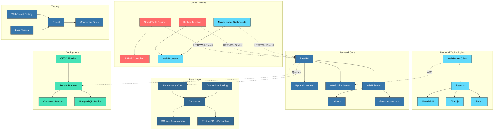

```mermaid
graph TD
    %% Client Devices
    subgraph "Client Devices"
        A1[Smart Table Devices] --> A2[ESP32 Controllers]
        A3[Kitchen Displays] --> A4[Web Browsers]
        A5[Management Dashboards] --> A4
    end

    %% Frontend
    subgraph "Frontend Technologies"
        B1[React.js] --> B2[Material-UI]
        B1 --> B3[Chart.js]
        B1 --> B4[Redux]
        B5[WebSocket Client] --> B1
    end

    %% Backend
    subgraph "Backend Core"
        C1[FastAPI] --> C2[Pydantic Models]
        C1 --> C3[WebSocket Server]
        C1 --> C4[ASGI Server]
        C4 --> C5[Uvicorn]
        C4 --> C6[Gunicorn Workers]
    end

    %% Database
    subgraph "Data Layer"
        D1[SQLAlchemy Core] --> D2[Databases]
        D2 --> D3[SQLite - Development]
        D2 --> D4[PostgreSQL - Production]
        D5[Connection Pooling] --> D2
    end

    %% Deployment
    subgraph "Deployment"
        E1[Render Platform] --> E2[Container Service]
        E1 --> E3[PostgreSQL Service]
        E4[CI/CD Pipeline] --> E1
    end

    %% Testing
    subgraph "Testing"
        F1[Pytest] --> F2[Concurrent Tests]
        F3[WebSocket Testing] --> F1
        F4[Load Testing] --> F1
    end

    %% Connections between sections
    A1 -.->|HTTP/WebSocket| C1
    A3 -.->|HTTP/WebSocket| C1
    A5 -.->|HTTP/WebSocket| C1
    B5 -.->|WSS| C3
    C1 -.->|Queries| D1
    C1 -.-> E1

    %% Styling
    classDef python fill:#3776AB,color:white,stroke:#333,stroke-width:1px
    classDef js fill:#F7DF1E,color:black,stroke:#333,stroke-width:1px
    classDef db fill:#336791,color:white,stroke:#333,stroke-width:1px
    classDef deploy fill:#46E3B7,color:black,stroke:#333,stroke-width:1px
    classDef hardware fill:#FF6B6B,color:white,stroke:#333,stroke-width:1px
    classDef client fill:#61DAFB,color:black,stroke:#333,stroke-width:1px

    class A1,A2,A3 hardware
    class A4,A5,B1,B2,B3,B4,B5 client
    class C1,C2,C3,C4,C5,C6,F1,F2,F3,F4 python
    class D1,D2,D3,D4,D5 db
    class E1,E2,E3,E4 deploy
``` 